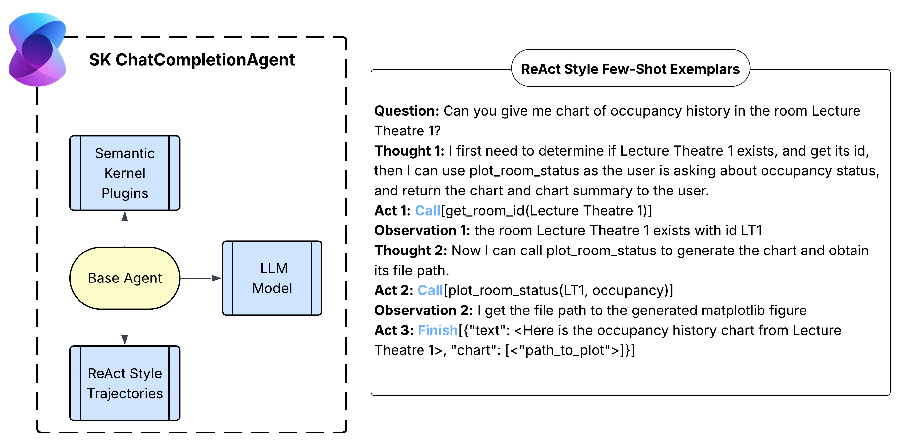
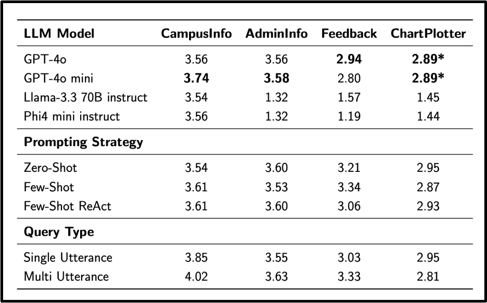

# SEAP: A Conversational Multi-Agent Platform for Smart Energy Awareness and Monitoring

A master's research project (Imperial College London x Microsoft), developed as part of the [**CampusConnect**](https://github.com/ese-ada-lovelace-2024/irp-microsoft/) with a focus on energy management.

<div align="center">

  []()
  [](https://esemsc-am4224.github.io/arastunm/assets/pdf/research-docs/am4224-final-report.pdf)
  [](https://techcommunity.microsoft.com/blog/educatordeveloperblog/conversational-agents-for-campus-energy-management/4454910)
  [](https://opensource.org/licenses/MIT)
  
  
</div>


<p align="center">
  </a>
  <em>
    High-level agent overview and an example ReAct (Reason + Act) style trajectory
    instruction. The base agent is comprised of a base model (an LLM), system instructions, and
    Semantic Kernel tool plugins. The ReAct trajectory steps are; Thought (Reasoning), Action
    (Tool Call), and Observation (Environment Response).
  </em>

<p align="center">
  </a>
  <em>
    Aggregated agentic performance scores for each agent and method. <b> Our key findings: (a) GPT-4o is the best performing base model for specialised agents; (b) Varying prompt strategies does not have significant influence on agent performance score, but on the response length; (c) IR agents (CampusInfo, AdminInfo) consistently outperform action-based (Feedback, ChartPlotter) agents. </b>
  </em>


## Overview

> **Abstract**
> Large Language Models (LLMs) are increasingly used in autonomous multi-agent systems.
They have seen extensive success in the fields of web navigation, software engineering, personalised learning and research. However, due to its technical and multi-facet
requirements (dynamic control and monitoring, feedback collection, sustainability initiatives),
energy management remains a challenging domain. We argue agentic systems can extend
traditional energy monitoring only solutions to serve a range of campus stakeholders (students,
faculty, and administrators).
This project leverages emerging frameworks in Microsoft’s AI Agent Services to demonstrate
a proof of concept for a smart energy management system. Building on base agents, it
integrates language and search services to enable a robust orchestration. The system includes
a user-facing chatbot that can respond to system-related queries, collect student feedback, and
assist administrators textual and visual prognostics. The project also designs a synthetic energy
data schema with hierarchical infrastructure, usage categories, and environmental context that
mirrors real world systems and supports agentic capabilities.
The system is evaluated on modular (individual agents and services) and end-to-end levels.
Special focus is given to explore intent routing, access-level based grounding mechanisms,
and query complexity. All together the assessments outline practical challenges of composite
agentic workflows and their integration with external services. They discuss promising future
directions through integrations with real-world energy systems.
> 


## 0. Project Structure

```
.
├── README.md
├── LICENSE
├── assets                  # project documents
├── review                  # literature review
├── platform                # platform source code
│   ├── evals/              # evaluation framework
│   ├── infra/              # azure resources setup
│   ├── src/                # source code
│   ├── ...
├── ...
```

## 2. Usage

Please follow the requirements as detailed in the [platform](platform/README.md) source code.


## Citation
```
```

## Acknowledgements
