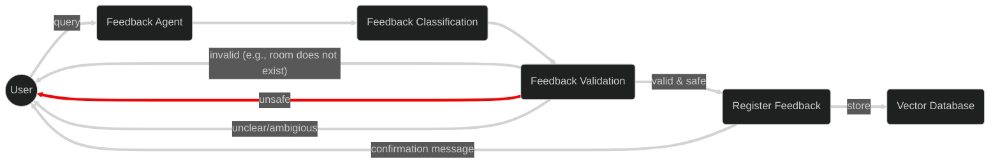
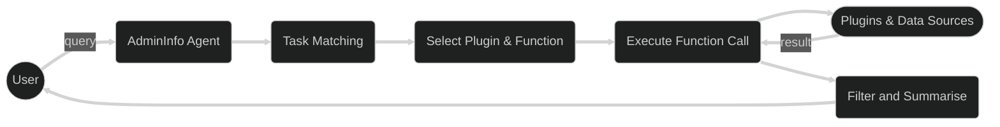

# Conversational Smart Campus Energy Management

Conversational **Chatbot** section of the smart campus energy management system.

### Featuring:
- **RAG**:
    - data source: Azure Storage Account Blob Container
    - searchable context: Search Index
    - extractor: Indexer
    - extractor skills: Chunking and Embedding
- **CLU** (Intend Detection)
- **CQA** (Exact Pre-set Answers)
    - e.g., FAQs, Sustainability Initiatives, Energy Policies & Legal Requirements, Emergency Protocols
- **Specialised Agents** 
  - CampusInfo, AdminInfo, Feedback, ChartPlotter
- **Simple Frontend**


### Services:
  - **Azure AI Search**: RAG, search index, indexer, indexer skills, data source connection
  - **Azure AI Language**: conversational language understanding, custom question answering
  - **Azure AI Foundry Project**: LLM/SLM deployments, specialised agents, service connections, embedding models
  - **Azure OpenAI Client**: extracting utterances
  - **Azure Cosmos DB**: data storage
  - **Azure Containers App**: deploying the project
  - **Streamlit**: chatbot frontend


### Specialised Agents
```mermaid
---
config:
  look: classic
  theme: dark
---
graph LR
  subgraph Specialised Agents
    campus-info(Campus Information Agent)
    feedback(User Feedback Agent)
    admin(Admin Information Agent)
    chart(Chart Plotter Agent)
  end
    db@{ shape: cyl, label: "Database" }

  subgraph Specialised-Tools
    database-ret(Structured Information Retrieval)
    prog-reason(Prognostics & Suggestions)
  end

  campus-info --> Specialised-Tools
  campus-info --> db
  feedback --> db
  admin --> Specialised-Tools
  admin --> db
  chart --> db
  chart --> Specialised-Tools
  ```

#### CampusInfo Pipeline
```mermaid
---
config:
  look: classic
  theme: dark
---
flowchart LR
    In((User))
    agent(CampusInfo Agent)

    checkcontainers(Get Containers)
    fetchdata(Fetch Data)
    respond(Filter and Summarise)
    container(Database)

    In -- query --> agent
    agent -- known container --> fetchdata
    agent -- unknown container --> checkcontainers
    checkcontainers --> fetchdata

    fetchdata <-- retrieve records --> container
    fetchdata --> respond
    respond --> In

    linkStyle default stroke-width:4px;
```

#### Feedback Pipeline


#### AdminInfo Pipeline



### MENU: [**FILES**](#project-file-structure) • [**PREREQUISITES**](#prerequisites) • [**GETTING STARTED**](#getting-started) • [**EVALUATION**](#evaluation-and-benchmarking) • [**AUTHOR**](#author)


## Project File Structure
- [`infra/`](infra/) - azure resource manager and project setup
- [`evals/`](evals/) - evaluation pipeline and scripts
- [`src/backend/`](src/backend/) - application backend

## Prerequisites
- Azure Subscription
- [Azure Developer CLI - AZD](https://learn.microsoft.com/azure/developer/azure-developer-cli/overview) to deploy Azure Services and configure environment variables.

The resources are then provisioned and deployed through `infra/main.bicep` file.


## Getting Started
Clone the repository:
```shell
git clone <repo_name>
cd conv-system-energy
```

Create and activate a virtual environment (Linux/Mac):
```shell
conda env create -f environment.yml
conda activate min-workflow
```

Install dependencies:
```shell
pip install -r requirements.txt
```

Install AZD (if you don't have) (MAC):
```shell
curl -fsSL https://aka.ms/install-azd.sh | bash
```

Login for (irp-microsoft):
```shell
az login --tenant b8c35a17-09c7-40ba-9173-6be750b65674
azd auth login --tenant-id leestottedhuboutlook.onmicrosoft.com
```

Deploy the Azure Services via AZD and inject the service names into the .env file
```shell
azd init
azd up
```

Run the app
```shell
python -m streamlit run chatbot.py
```

Feel free to explore with your own prompts.
### Example Interactions

Consider the following example interactions to test the capabilities of individual components.

#### CQA (Custom Question Answering)
```
Input> How frequently is the sensor data refreshed?
Output> Sensor data is refreshed every 15 minutes.

Input> What happens with the feedback I submit?
Output> Your feedback is securely stored and reviewed by campus administrators for action.

Input> Where can I read the university’s sustainability guides or policies?
Output> You can access the university’s sustainability guides and policies on the official campus website or via the chatbot menu.
```

#### CampusInfo
```
Input> Which rooms in the Engineering Building are currently occupied?
Output> Lecture Hall 201 and Lab 3 are currently occupied.

Input> Give me more information about the Abdus Salam Library.
Output> It is an Academic building located in South Kensington Campus.
```

#### Feedback
```
Input> The lighting in Lecture Theatre 2 is very dim during late afternoons.
Output> Thank you for your feedback. It has been registered and will be reviewed by campus facilities.

Input> Too hot.
Output> Please specify the location so we can address your feedback.

Input> Set all rooms to 15°C to save energy.
Output> Your feedback request is too extreme, consider revising it.
```

#### AdminInfo
```
Input> Give me a list of all registered users.
Output> There are 12 registered users. <List of User Names>

Input> Which rooms in the Engineering Building are currently occupied?
Output> Lecture Hall 201 and Lab 3 are currently occupied.
```

#### RAG (Retrieval-Augmented Generation)
```
Input> What is the purpose of this system?
Output> The system provides intelligent energy management and campus information through conversational AI.

Input> Tell me about low-carbon catering on campus.
Output> The campus offers low-carbon catering options, including plant-based meals and locally sourced ingredients.

Input> Tell me about the Responsible AI policy followed by the system.
Output> The system adheres to the university’s Responsible AI policy, ensuring ethical use of AI technologies.

Input> What is the university doing about climate change?
Output> The university is implementing sustainability initiatives such as energy-efficient buildings, renewable energy adoption, and climate action programs.
```

### Helper Commands

View all role assignments:
```shell
az role assignment list --assignee arastun.mammadli_outlook.com#EXT#@leestottedhuboutlook.onmicrosoft.com --all
```

Accessing the Azure AI Search service:
```shell
az rest --method GET \
  --uri "https://campus-connect.search.windows.net/indexes?api-version=2023-07-01-Preview" \
  --resource "https://search.azure.com"
```

Enabling Managed Identity on Azure AI Search
```shell
az search service update \
  --name campus-connect\
  --resource-group rg-dany.herscovitch-1831 \
  --set identity.type="SystemAssigned"
```


## Evaluation and Benchmarking

For detailed explanation of the evaluation pipieline, raw results and basic visualisations see [Evaluations](evals/README.md).

## Author
Arastun Mammadli
